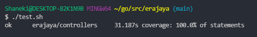

  <h3 align="center">Backend Test Erajaya</h3>

  

    Dokumentasi RESTful API Backend Test Erajaya
     
    <a href="https://app.swaggerhub.com/apis-docs/sahrilmahendra/backend-test-erajaya/1.0#/"><strong>Explore the docs Open API »</strong></a>
     
  

<!-- ABOUT THE PROJECT -->
## About The Project

Berikut fitur yang terdapat dalam project ini :
| Feature | Authentication
|---|---|
| Create product | No |
| Get all products | No |
| Get all products by created at | No |
| Get all product by name (asc) | No |
| Get all product by name (desc) | No |
| Get all product by price (asc) | No |
| Get all product by price (desc) | No |

(<a href="#top">back to top</a>)

## Unit Testing
  

(<a href="#top">back to top</a>)

### Built With

<!-- * [Golang](https://golang.org/)
* [Echo Framework](https://echo.labstack.com/)
* [MySQL](https://www.mysql.com/)
* [Gorm](https://gorm.io/)
* [VS Code](https://code.visualstudio.com/) -->
&nbsp;
&nbsp;
&nbsp;

(<a href="#top">back to top</a>)

<!-- Architecture -->
## Architecture
Dalam mengerjakan tes ini saya menggunakan konsep MVC (Model View Controller) yang mana apabila terjadi maintenance akan mudah untuk dikerjakan,
karena MVC memetakan setiap bagian kedalam struktur dengan jelas.

(<a href="#top">back to top</a>)

<!-- CONTACT -->
## Contact

Project Link : [https://github.com/sahrilmahendra/backend-test](https://github.com/sahrilmahendra/backend-test) 
Open API Documentation : [https://app.swaggerhub.com/apis-docs/sahrilmahendra/backend-test-erajaya/1.0#/](https://app.swaggerhub.com/apis-docs/sahrilmahendra/backend-test-erajaya/1.0#/)&nbsp;
<!-- :heart: -->
<!-- CONTRIBUTOR -->
Contributor :
 

(<a href="#top">back to top</a>)

<h3>

:copyright: 2022 | Built with :heart: from us

</h3>
<!-- end -->
